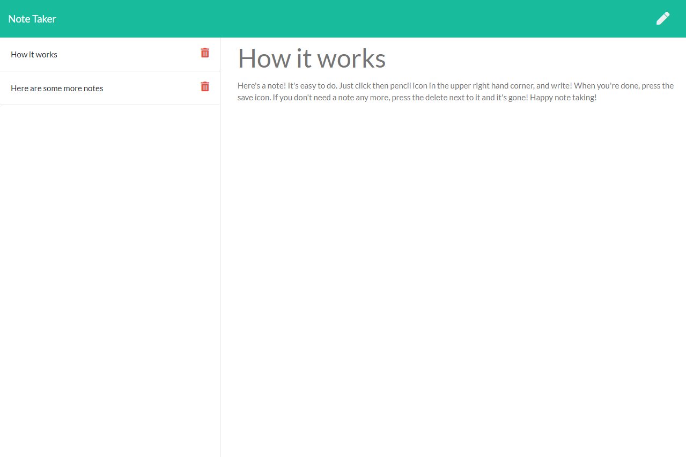

# Note Taker

https://rebgrasshopper-note-taker.herokuapp.com/

Table Of Contents:

- [Section 1: Introduction](#introduction)
- [Section 2: Installation](#installation)
- [Section 3: Usage](#usage)
- [Section 4: License](#license)
- [Section 5: Credits](#credits)

## Introduction:

This project is a note taker built with javascript, and run on an express server. It offers a simple interface to write, view, and delete notes.

## Installation:

You can access this project on any browser and run it there. It requires no other installation.

## Usage:

You are free to use the code for any project you wish within the limits of the GNU license. You can access it via downloading files directly from GitHub or forking the repo for your own use. Remember that if you run this server locally, you will have to npm install on your terminal in order to have access to the necessary libraries.

## License:

GNU General Public License v3.0

## Credits:
Thanks, Clyde, for excellent troubleshooting!
- [Clyde Baron Rapinan](https://github.com/clydebaron2000)

## Questions: 

You can contact me with questions via:
- [Email](plover.brown@gmail.com)
- [GitHub](https://www.github.com/rebgrasshopper)
- [LinkedIn](https://www.linkedin.com/in/plover-brown-37b6981a5)
